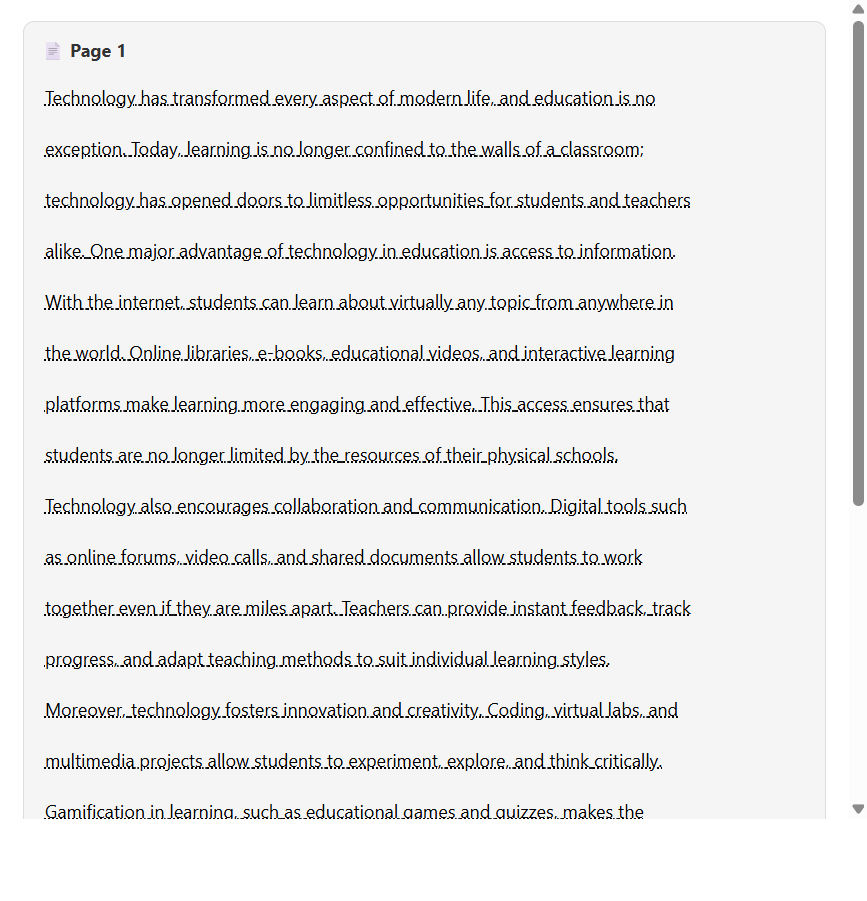
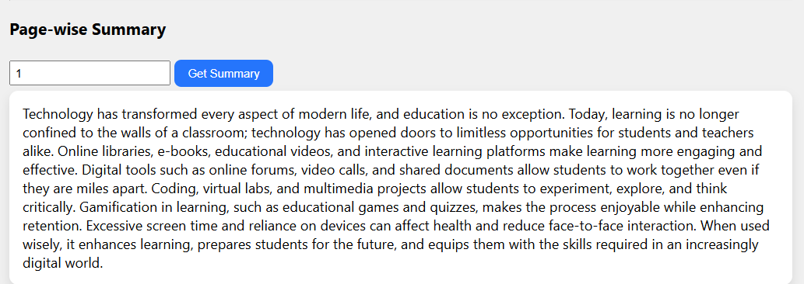
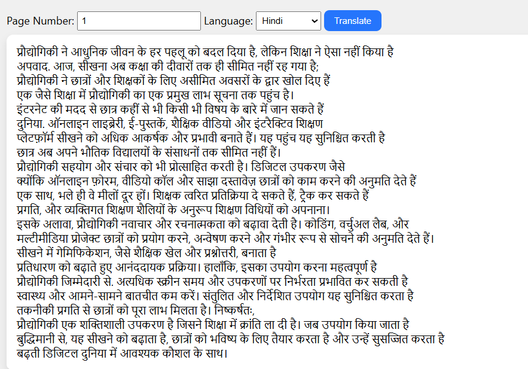
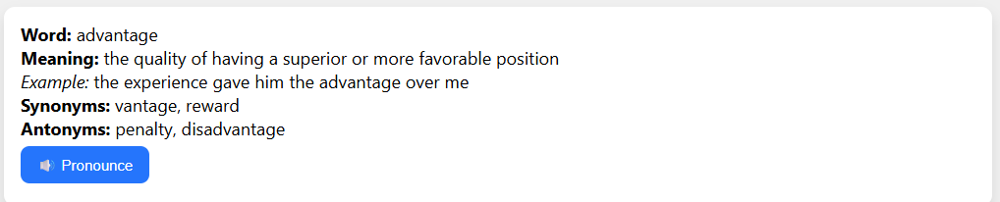
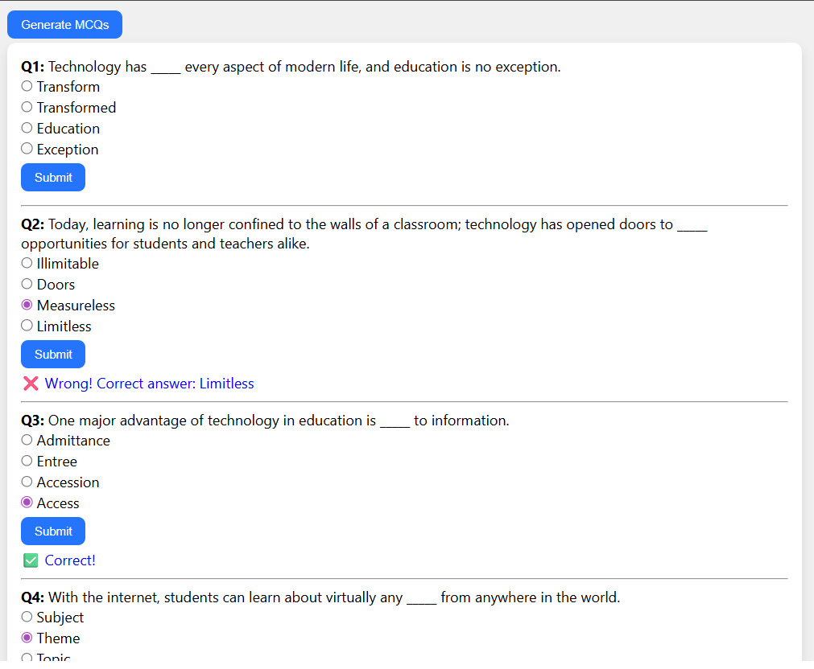
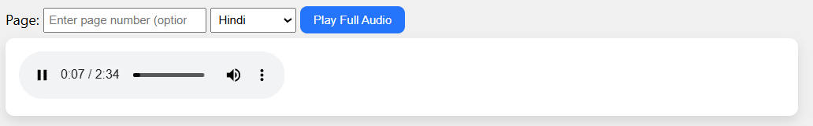
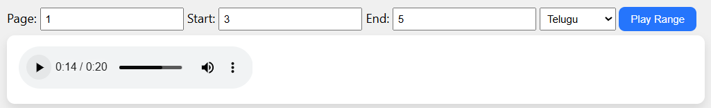

# AI Reading Companion
## Overview:

AI-Powered Reading Companion is a web-based application developed using Python and Flask that helps users read and understand digital documents more effectively. The system allows users to upload documents, extracts text from them, and provides multiple AI-based features to improve comprehension and learning.

It integrates Natural Language Processing techniques to offer functionalities such as text summarization, language translation, text-to-speech conversion, vocabulary assistance,and MCQ generation. These features make reading more interactive, accessible, and learner-friendly.
This project is designed to assist students and learners by simplifying complex content and improving engagement with digital reading materials.

## Problem Statement

Reading lengthy digital documents can be challenging, especially for students and learners who need to quickly understand complex information. Traditional reading methods often lack interactive features such as summarization, vocabulary support, translation, and audio assistance, making the learning process time-consuming and less engaging.
This project addresses these challenges by providing an AI-powered reading companion that enhances document comprehension through intelligent features like text summarization, language translation, text-to-speech conversion, vocabulary assistance, line-range reading, and automatic MCQ generation, creating a more interactive and accessible reading experience.

## Features:

- Document text extraction from uploaded files
- Text summarization
- Language translation
- Line Range Reader
- Text-to-speech conversion
- Vocabulary assistance
- MCQ generation from content

## Screenshots

### Upload Document

Users can upload a document for AI-based processing.


### Extracted Text

Displays the extracted text from the uploaded document.



### Text Summarization

Generates a concise summary of the uploaded document.



### Language Translation

Translates the extracted text into the selected language.



### Vocabulary Assistance

Provides meanings of difficult words and do pronounce to improve comprehension.



### MCQ Generation

Automatically generates multiple-choice questions from the document.



### Full Audio

Reads the complete document using text-to-speech.



### Line Range Audio
Reads only the selected range of lines.


## Technologies Used:

- [Python](https://www.python.org/)
- [Flask](https://flask.palletsprojects.com/)
- [HTML](https://developer.mozilla.org/en-US/docs/Web/HTML)
- [CSS](https://developer.mozilla.org/en-US/docs/Web/CSS)
- [JSON](https://www.json.org/)
- NLP concepts

## Project Structure

* app.py
* dataset/
* templates/
  * index.html
  * result.html
* static/
  * style.css
* requirements.txt
* README.md
* .gitignore

## How to Run

1. Clone the repository:

   ```bash
   git clone https://github.com/jananikookie/AI-Powered-Reading-Companion.git
   ```

2. Navigate to the project directory:

   ```bash
   cd AI-Powered-Reading-Companion
   ```

3. Install the required dependencies:

   ```bash
   pip install -r requirements.txt
   ```

4. Run the application:

   ```bash
   python app.py
   ```

5. Open your browser and visit:

   ```
   http://127.0.0.1:5000/
   ```

6. Upload a document and explore the AI-powered features.

## Future Enhancements

- Support for additional document formats
- Improved AI-based summarization accuracy
- Advanced MCQ generation 
- User authentication and document history tracking
- Enhanced user interface

## Author

Janani


